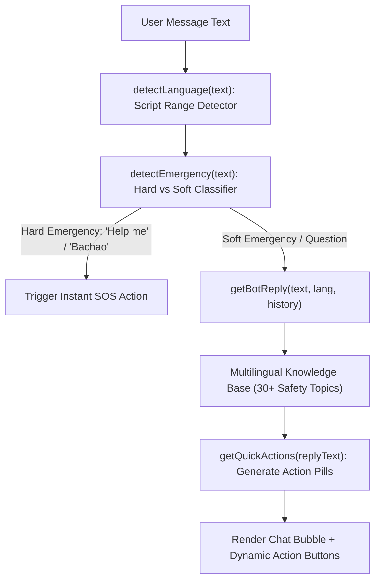

# 🤖 Momo AI Assistant Brain (`momoAI.js`)

**Momo** is Safety Guardian's offline-first, zero-latency safety companion. It operates 100% on the client device without sending private conversation logs to external cloud servers.

---

## 🧠 Capabilities & Architecture

---

## 🛡️ Emergency Intent Classification
- **Hard Emergency** (`isHard`): Regex patterns like `/^help me$/i`, `/^bachao$/i`. Directly prompts immediate SOS activation.
- **Soft Emergency** (`isSoft`): Regex patterns like `/being followed/`, `/chest pain/`, `/gas leak/`. Provides calming step-by-step guidance and presents a floating SOS shortcut.
