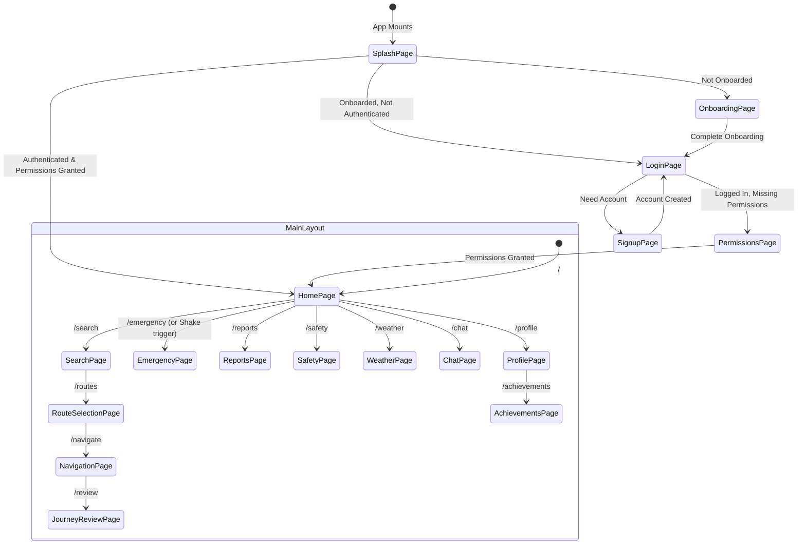

# 🔄 Application Lifecycle & Route Guards

The Safety Guardian application controls user navigation using **React Router v7** combined with **Firebase Authentication** listeners and **Zustand** persistent state flags.

---

## 🚦 Route Guard State Machine



---

## 🛡️ Authentication & Permission Gates

### 1. PrivateRoute Implementation (`src/App.jsx`)
```jsx
function PrivateRoute({ children }) {
  const { isLoggedIn, hasPermissions } = useAppStore();
  if (!isLoggedIn)    return <Navigate to="/login"       replace />;
  if (!hasPermissions) return <Navigate to="/permissions" replace />;
  return children;
}
```

- **`isLoggedIn`**: Tracked via Firebase `onAuthStateChanged` listener in `src/App.jsx`.
- **`hasPermissions`**: Tracks user approval for Geolocation and Device Sensors (required for GPS navigation and Shake-to-SOS).

---

## 🌐 Global Persistent Listeners

1. **`onAuthStateChanged(auth, callback)`**:
   - Updates Zustand `user` profile with name, email, avatar, and phone.
   - Automatically invokes `loadContacts(user.uid)` to load isolated emergency contacts.
2. **`ShakeSOSListener`**:
   - Active on all routes when `isLoggedIn === true`.
   - Uses [[Shake-Detection-Hook]] to intercept sudden motion spikes ($>25\text{ m/s}^2$) and redirects directly to [[EmergencyPage]].
