# 🌲 Component Tree

Safety Guardian features a modular component tree designed to separate mapping canvases, floating HUD controls, and interactive bottom sheets.

---

## 📊 Visual Hierarchy

```mermaid
graph TD
    App["App.jsx (Root BrowserRouter + ShakeSOSListener)"]
    App --> Splash["SplashPage.jsx (/splash)"]
    App --> Onboard["OnboardingPage.jsx (/onboarding)"]
    App --> Login["LoginPage.jsx (/login)"]
    App --> Signup["SignupPage.jsx (/signup)"]
    App --> Perms["PermissionsPage.jsx (/permissions)"]
    App --> SOSPage["EmergencyPage.jsx (/emergency)"]
    App --> Main["MainLayout.jsx (/ - Protected Layout)"]

    Main --> Home["HomePage.jsx (/)"]
    Main --> Search["SearchPage.jsx (/search)"]
    Main --> RouteSel["RouteSelectionPage.jsx (/routes)"]
    Main --> Nav["NavigationPage.jsx (/navigate)"]
    Main --> Reports["ReportsPage.jsx (/reports)"]
    Main --> Safety["SafetyPage.jsx (/safety)"]
    Main --> Weather["WeatherPage.jsx (/weather)"]
    Main --> Chat["ChatPage.jsx (/chat)"]
    Main --> Profile["ProfilePage.jsx (/profile)"]
    Main --> Review["JourneyReviewPage.jsx (/review)"]
    Main --> Badges["AchievementsPage.jsx (/achievements)"]

    Home --> WCard["WeatherCard.jsx"]
    Home --> SOSBtn["SOSButton.jsx"]
    Home --> HomeMap["Leaflet MapContainer + Google Tiles"]

    RouteSel --> RouteMap["Leaflet MapContainer + Multi-Polyline Casing"]
    RouteSel --> BottomSheet["3-State Collapsible Route Selector Sheet"]

    Reports --> ReportForm["ReportDetailsForm.jsx"]
    Reports --> ReportFilter["ReportFilters.jsx"]
    Reports --> LocPicker["LocationPicker.jsx"]
    Reports --> SevPicker["SeverityPicker.jsx"]
    Reports --> HazPicker["HazardCategoryPicker.jsx"]
    Reports --> RCard["ReportCard.jsx"]
```

---

## 🧩 Major Shared Components

| Component | File Path | Usage & Responsibilities |
| :--- | :--- | :--- |
| **[[MainLayout]]** | `src/components/navigation/MainLayout.jsx` | Persistent bottom tab navigation bar, active route highlighting, safe-area insets. |
| **[[WeatherCard]]** | `src/components/WeatherCard.jsx` | Home screen weather widget, temperature, humidity, wind, and AQI indicator. |
| **[[SOSButton]]** | `src/components/buttons/SOSButton.jsx` | Long-press and tap emergency SOS button with expanding ripple animations. |
| **[[ReportCard]]** | `src/components/reports/ReportCard.jsx` | Card element displaying live community hazard, distance from user, timestamp, upvotes. |
| **[[LocationPicker]]** | `src/components/reports/LocationPicker.jsx` | Interactive mini-map modal for selecting exact latitude/longitude for a new report. |
| **[[SeverityPicker]]** | `src/components/reports/SeverityPicker.jsx` | 4-tier risk selector (Low, Medium, High, Critical) with color tags. |
| **[[HazardCategoryPicker]]** | `src/components/reports/HazardCategoryPicker.jsx` | Categorized icon grid (Traffic, Natural, Fire, Infra, Crime, Public). |
