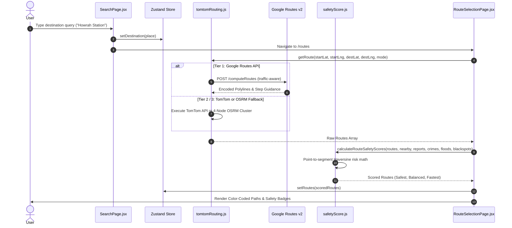
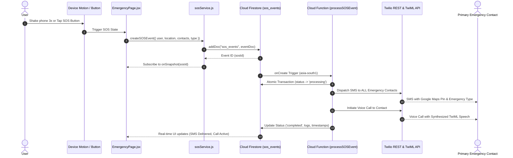

# 🌊 Data Flow & Telemetry Pipelines

This document details the exact data flow across Safety Guardian's primary operations: navigation computation, community hazard syncing, and emergency telemetry.

---

## 🗺️ 1. Route Generation & Safety Evaluation Pipeline

---

## 🚨 2. Emergency SOS Execution Pipeline

