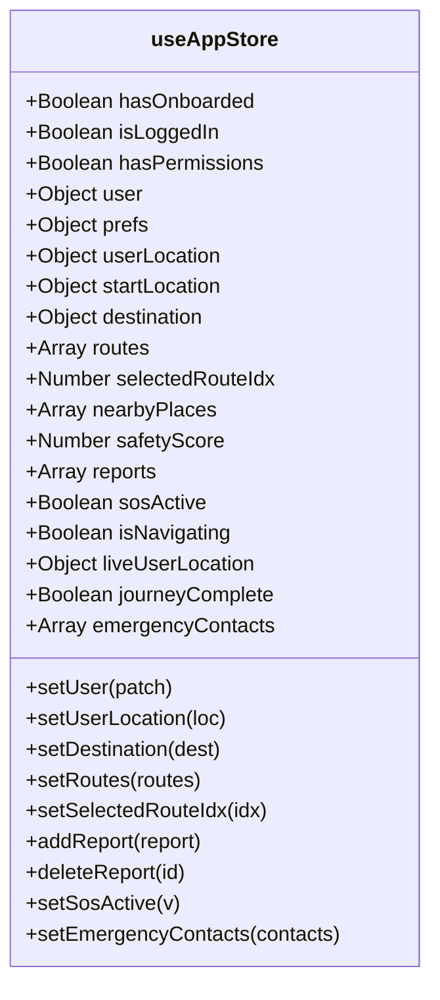

# 🗃️ State Management (Zustand)

Safety Guardian uses **Zustand** (`src/context/store.js`) as its single source of truth for global application state. Zustand was selected over Redux or Context API for its zero-boilerplate hooks, minimal re-render overhead, and direct outside-React read/write capability.

---

## 📦 Store Schema Reference (`useAppStore`)

---

## 🔑 State Slices & Invariants

### 1. User & Authentication Slice
- `user`: `{ name, email, avatar, phone, memberSince }`
- `prefs`: `{ avoidUnlit: true, autoShareWalk: false, safeZoneAlerts: true, liveFriendTracking: false }`
- `emergencyContacts`: Array of emergency contacts isolated to `user.uid` loaded from Firestore via [[contactsService-Service]].

### 2. Geolocation & Navigation Slice
- `userLocation`: `{ lat, lng, simulated }` — Current coarse/fine GPS coordinate used for map centering.
- `startLocation`: Optional override start point for route planning.
- `destination`: Destination object with `{ name, displayName, lat, lng }`.
- `routes`: Evaluated route options populated with geometries, turn-by-turn steps, via-road descriptions, and safety scores.
- `selectedRouteIdx`: Currently highlighted route option (0 = Safest, 1 = Balanced, 2 = Least Safe / Fastest).
- `liveUserLocation`: High-frequency GPS updates during active turn-by-turn navigation in [[NavigationPage]].

### 3. Community Intelligence Slice
- `reports`: Array of real-time community reports synced from Cloud Firestore `reports` collection via [[reportService-Service]].
- `safetyScore`: Overall local safety score (0–100) calculated for the [[HomePage]] safety badge.
