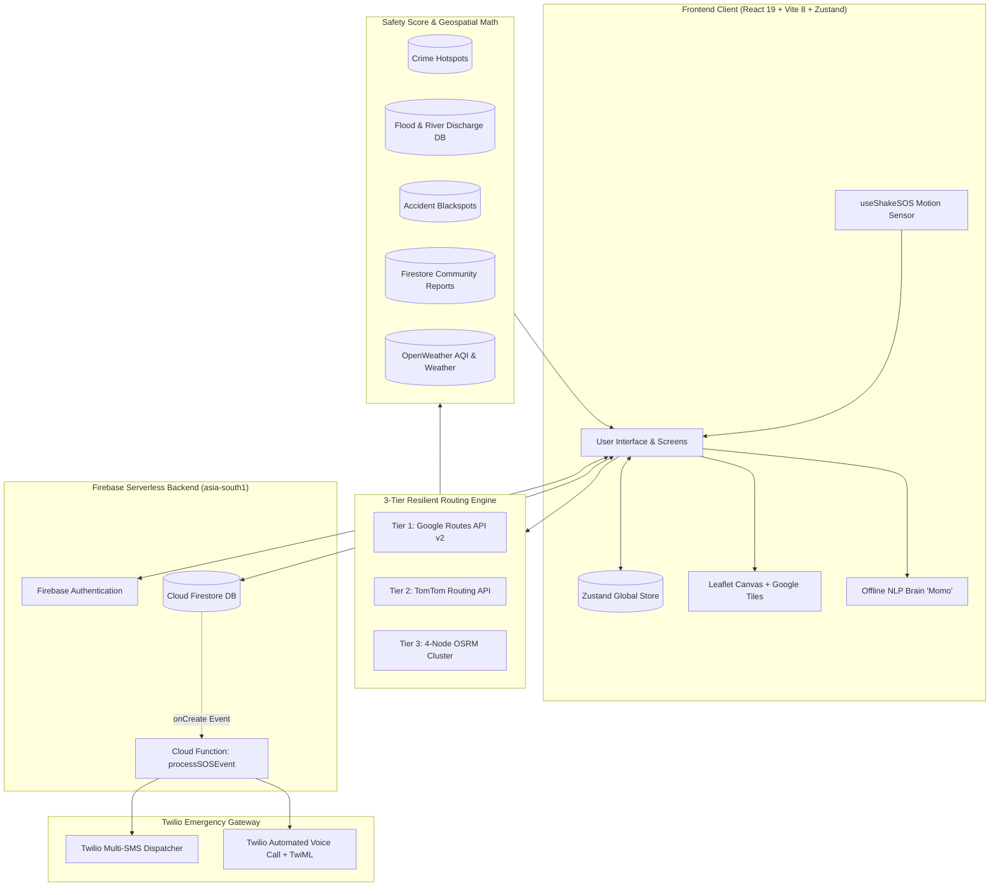

# 🛡️ Safety Guardian — Knowledge Graph & Second Brain

Welcome to the **Safety Guardian Living Knowledge Base**. This Obsidian Vault provides complete architecture blueprints, data flow diagrams, route scoring mathematics, emergency telephony pipelines, and component references for the Safety Guardian codebase.

---

## ⚡ Token-Saving Fast Lookup
> 🚀 **Working on a bug or feature?** Jump immediately to the **[[⚡-AI-and-Developer-Quick-Fix-Index]]** for a direct problem-to-file routing table!

---

## 🧭 Visual Vault Map

```mermaid
graph TD
    Dashboard["🛡️ Dashboard"]
    Dashboard --> QuickFix["⚡ Quick-Fix Index"]
    Dashboard --> Arch["🏗️ Architecture"]
    Dashboard --> Route["🛣️ Routing Engine"]
    Dashboard --> Safety["🧠 Safety Intelligence"]
    Dashboard --> SOS["🚨 Emergency System"]
    Dashboard --> AI["🤖 Momo AI Engine"]
    Dashboard --> Pages["📱 Pages (17 Screens)"]
    Dashboard --> Comp["🧩 UI Components"]
    Dashboard --> Serv["⚙️ Services (23 Modules)"]
    Dashboard --> APIs["🌐 Cloud & APIs"]
    Dashboard --> Sec["🔒 Security & Rules"]
    Dashboard --> Workflows["🔄 Operational Workflows"]
    Dashboard --> Dev["🛠️ Developer Guide"]

    click QuickFix "[[⚡-AI-and-Developer-Quick-Fix-Index]]"
    click Arch "[[Overview]]"
    click Route "[[Routing-Overview]]"
    click Safety "[[Safety-Score-Engine]]"
    click SOS "[[SOS-Architecture]]"
    click AI "[[Momo-AI-Brain]]"
    click Pages "[[HomePage]]"
    click Comp "[[MainLayout]]"
    click Serv "[[safetyScore-Service]]"
    click APIs "[[Firebase-and-Firestore]]"
    click Sec "[[Security-Architecture]]"
    click Workflows "[[App-Startup-Flow]]"
    click Dev "[[Getting-Started]]"
```

---

## ⚡ Core Domain Index

| Domain | Key Notes | Implementation Files |
| :--- | :--- | :--- |
| **Quick Fixes** | [[⚡-AI-and-Developer-Quick-Fix-Index]] | Fast token-efficient problem lookup |
| **System Architecture** | [[Overview]], [[Application-Lifecycle]], [[Component-Tree]], [[State-Management]], [[Data-Flow]] | `src/App.jsx`, `src/context/store.js` |
| **Routing & Navigation** | [[Routing-Overview]], [[Google-Routes-Service]], [[TomTom-Routing-Service]], [[OSRM-Fallback-Cluster]], [[Street-Geometry-Parsing]] | `src/services/googleRouting.js`, `src/services/tomtomRouting.js` |
| **Safety Intelligence** | [[Safety-Score-Engine]], [[Crime-Hotspots-Data]], [[Flood-Zones-Data]], [[Disaster-Zones-Data]], [[Accident-Blackspots-Data]], [[Environmental-Risk-Engine]] | `src/services/safetyScore.js`, `src/services/safetyRisk.js` |
| **Emergency Telephony** | [[SOS-Architecture]], [[Cloud-Functions-Gateway]], [[Shake-Detection-Hook]], [[Twilio-SMS-Voice-Pipeline]], [[Medical-Emergency-Profile]] | `src/services/sosService.js`, `functions/index.js` |
| **AI Assistant (Momo)** | [[Momo-AI-Brain]], [[Multilingual-NLP-Engine]], [[Gemini-AI-Integration]] | `src/services/momoAI.js`, `src/services/gemini.js` |
| **Screens (17 Pages)** | [[HomePage]], [[RouteSelectionPage]], [[NavigationPage]], [[EmergencyPage]], [[ReportsPage]], [[SafetyPage]], [[WeatherPage]], [[ChatPage]], [[ProfilePage]] | `src/pages/*` |
| **UI Components** | [[MainLayout]], [[WeatherCard]], [[SOSButton]], [[ReportCard]], [[LocationPicker]], [[SeverityPicker]], [[HazardCategoryPicker]] | `src/components/*` |
| **Services (23 Modules)** | [[tomtomRouting-Service]], [[tomtomTraffic-Service]], [[safetyScore-Service]], [[sosService-Service]], [[momoAI-Service]], [[medicalService-Service]] | `src/services/*` |
| **Backend & Cloud** | [[Firebase-and-Firestore]], [[Google-Routes-API]], [[TomTom-APIs]], [[OpenWeatherMap-API]], [[Twilio-Telephony-API]] | `firebase.json`, `functions/*` |
| **Security & Rules** | [[Security-Architecture]], [[Firestore-Security-Rules]], [[API-Key-Protection]], [[Content-Security-Policy]] | `firestore.rules`, `vite.config.js` |
| **Workflows** | [[App-Startup-Flow]], [[Route-Search-and-Selection-Flow]], [[Turn-by-Turn-Navigation-Flow]], [[SOS-Emergency-Trigger-Flow]], [[Incident-Reporting-Flow]] | End-to-end user flows |
| **Developer Hub** | [[Getting-Started]], [[Environment-Variables]], [[Project-Structure]], [[Known-Issues]], [[Technical-Debt]], [[Roadmap]], [[Glossary]] | `.env.example`, `package.json` |

---

## 🏛️ System High-Level Topology

---

## 📌 Architectural Guarantees

1. **Safety Over Speed**: [[Safety-Score-Engine]] calculates $\text{Base (96)} - \sum \text{Penalties}$. The safest route is highlighted in emerald green with visual precedence.
2. **Zero-Failure Routing**: If Google Routes fails, [[TomTom-Routing-Service]] takes over; if TomTom fails, [[OSRM-Fallback-Cluster]] steps in; if completely offline, synthetic demo routes keep the UI responsive.
3. **Guaranteed Emergency Dispatch**: Triggering SOS in [[SOS-Architecture]] writes to Firestore `sos_events`, locking and executing SMS and automated phone calls via [[Cloud-Functions-Gateway]]. If offline, [[smsRedirect-Service]] launches native SMS intents.
4. **Data Isolation**: [[Firestore-Security-Rules]] ensure that users can only read/write their own records, preventing cross-user data leakage.
