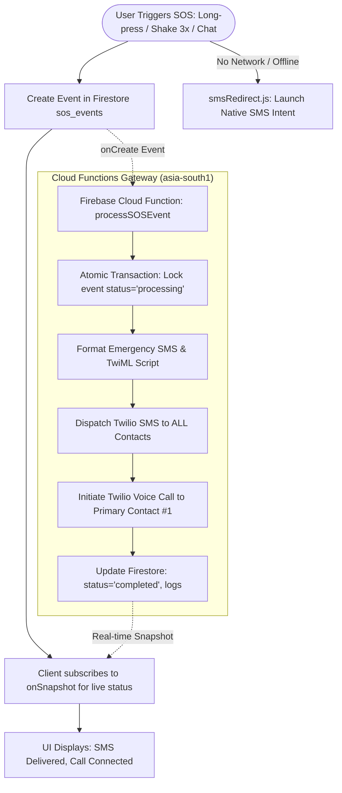

# 🚨 Emergency SOS Architecture

The **Emergency SOS System** in Safety Guardian is built for zero-failure dispatch. It bridges frontend gesture triggers, Firestore real-time synchronization, and a backend Cloud Functions telephony bridge.

---

## 🔁 End-to-End Emergency Telephony Lifecycle



---

## 📄 SOS Event Document Schema (`sos_events`)

```json
{
  "status": "pending | processing | sms_sent | call_attempted | completed | failed",
  "userId": "firebase_auth_uid",
  "userName": "Rohan Sharma",
  "userPhone": "+919876543210",
  "latitude": 22.572645,
  "longitude": 88.363892,
  "accuracy": 12.5,
  "mapsLink": "https://maps.google.com/?q=22.572645,88.363892",
  "emergencyType": "medical | crime | accident | fire | general",
  "contacts": [
    { "name": "Priya Sharma", "phone": "+919876500001", "relationship": "Sister", "priority": 1 },
    { "name": "Amit Sharma", "phone": "+919876500002", "relationship": "Father", "priority": 2 }
  ],
  "createdAt": "serverTimestamp()",
  "smsStatus": "sent",
  "callStatus": "attempted",
  "logs": [
    { "step": "LOCKED", "time": "2026-08-29T10:00:00.000Z", "msg": "Gateway acquired lock" },
    { "step": "SMS_SENT", "contact": "Priya Sharma", "msg": "SMS delivered (SMxxx)" },
    { "step": "CALL_INITIATED", "contact": "Priya Sharma", "msg": "Call initiated (CAxxx)" }
  ]
}
```
