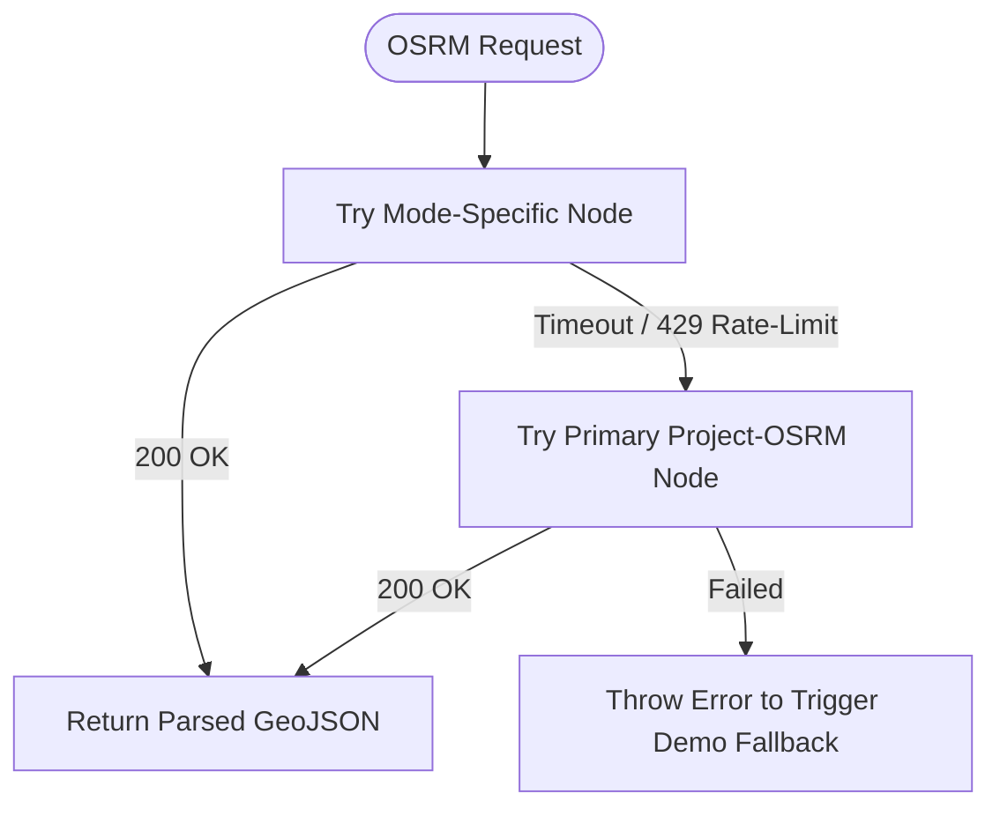

# 🐧 OSRM Multi-Node Fallback Cluster

When external API keys are unavailable or internet connectivity is restricted, Safety Guardian utilizes a **4-node Open Source Routing Machine (OSRM)** cluster.

---

## 🌐 Cluster Endpoints

```javascript
const OSRM_ENDPOINTS = [
  'https://router.project-osrm.org/route/v1',              // Primary Global Node
  'https://routing.openstreetmap.de/routed-car/route/v1',   // Dedicated Car Node (FOSSGIS)
  'https://routing.openstreetmap.de/routed-bike/route/v1',  // Dedicated Bicycle Node
  'https://routing.openstreetmap.de/routed-foot/route/v1'   // Dedicated Pedestrian Node
]
```

---

## 🔁 Node Redundancy & Retry Logic



---

## ⚡ Mode Multipliers
Because OSRM car routing profiles are standard, pedestrians and cyclists receive calibrated speed adjustment multipliers when driving profiles are evaluated:
- **Driving**: $1.0\times$
- **Cycling**: $2.1\times$ duration multiplier
- **Walking**: $4.2\times$ duration multiplier
