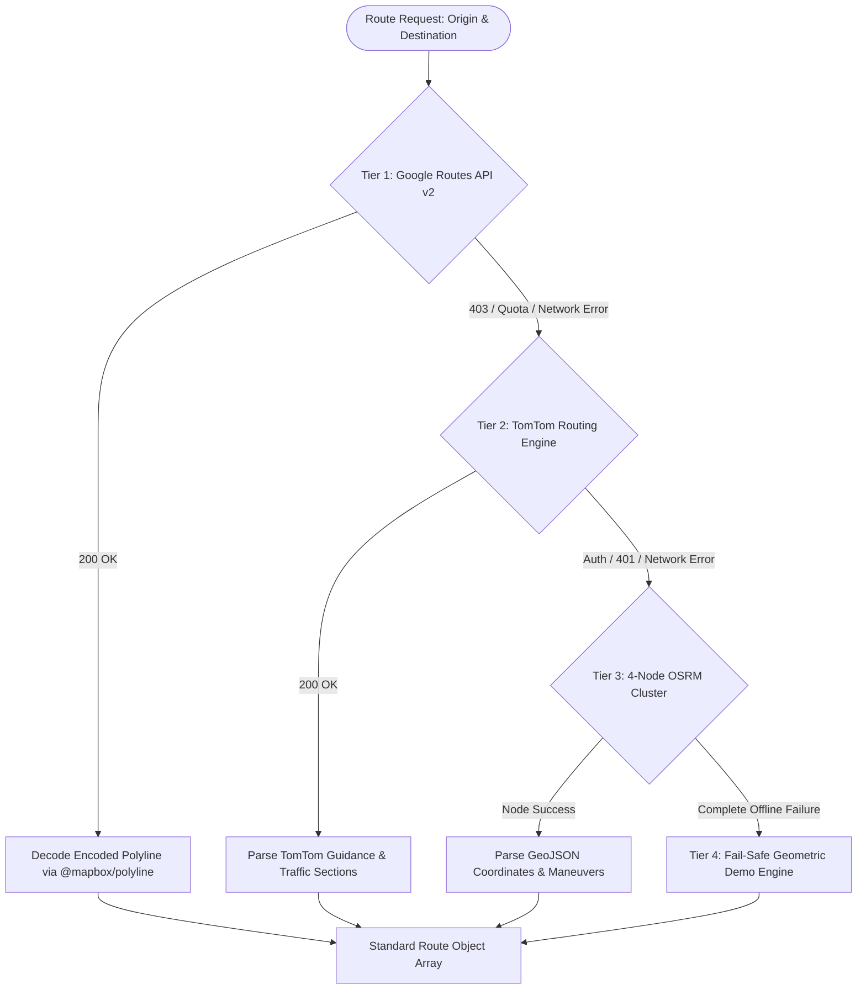

# 🛣️ Routing Engine Architecture

The Safety Guardian routing engine implements a **high-resilience 3-tier fallback architecture** orchestrated by `src/services/tomtomRouting.js` and `src/services/googleRouting.js`. This multi-provider setup guarantees uninterrupted navigation service even when commercial API quotas expire or network partitions occur.

---

## 🏛️ Routing Provider Cascade

---

## 📊 Feature Matrix by Provider

| Feature | Tier 1: Google Routes v2 | Tier 2: TomTom Routing | Tier 3: OSRM Cluster | Tier 4: Demo Fallback |
| :--- | :--- | :--- | :--- | :--- |
| **Primary Route Precision** | Hyper-accurate (Gullies & lanes) | High (Arterial + local) | High (OpenStreetMap data) | Synthetic baseline |
| **Live Traffic Delays** | ✅ `TRAFFIC_AWARE` mode | ✅ Segment speed ratios | ❌ Free-flow estimate | ❌ Fixed delay |
| **Geometry Format** | Encoded string polyline | Array of lat/lng coordinate objects | GeoJSON `[lng, lat]` | Pre-calculated coordinates |
| **Turn-by-turn Guidance** | ✅ Detailed maneuvers | ✅ Guidance instructions + icons | ✅ OSRM maneuver steps | ✅ Mock turn steps |
| **Via-Road Extraction** | Route description tags | Step street names | Road summary / step names | Hardcoded corridor names |
| **Cost & API Keys** | Requires Google Maps API Key | Requires TomTom Key | 100% Free / No Key | No network required |

---

## 🔗 Related Routing Notes
- [[Google-Routes-Service]] — Google Routes API v2 payload and decoding.
- [[TomTom-Routing-Service]] — TomTom dual fastest/shortest alternative queries.
- [[OSRM-Fallback-Cluster]] — Multi-node redundancy for car, bike, and foot.
- [[Street-Geometry-Parsing]] — Transforming raw responses into uniform route schemas.
- [[Dashboard]] — Back to Dashboard.
