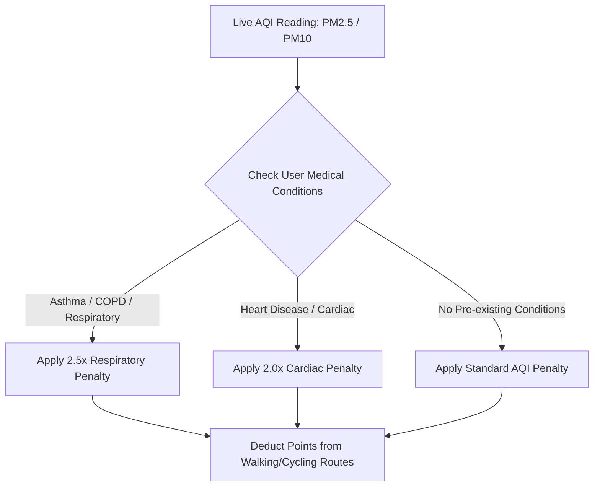

# 🌿 Environmental Risk & Medical Sensitivity (`environmentalService.js`)

Safety Guardian dynamically personalizes route safety based on **Air Quality Index (AQI)**, **UV Index**, and the user's **Personal Medical Profile** (`src/services/medicalService.js`).

---

## 🩺 Medical Sensitivity Penalty Matrix

---

## 🚶 Mode Sensitivity
Environmental penalties are strictly applied to open-air transport modes (**walking** and **cycling**), leaving air-conditioned automobile routing unaffected while warning the driver.
