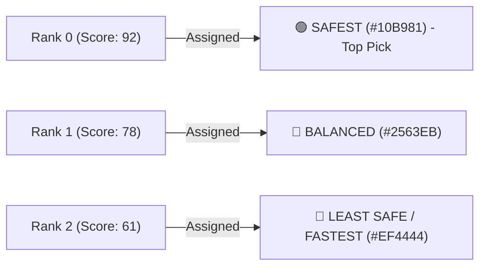

# 🧠 Safety Score Calculation Engine (`safetyScore.js`)

The `src/services/safetyScore.js` module is the core algorithmic differentiator of Safety Guardian. It computes safety scores ($10 - 100$) for candidate routes and local areas using geospatial point-to-polyline mathematics.

---

## 📐 Mathematical Formulation

### 1. Base Score & Penalty Formula
Every route candidate begins at a baseline score:
$$\text{Base Score} = 96$$

For each hazard item $h$ intersecting a route polyline within its specific threshold radius $R_h$:
$$\text{Penalty}(h) = \text{BasePenalty}_h \times \text{SeverityMultiplier}_h$$

The total route safety score $S_{\text{route}}$ is bounded between $\text{MIN\_SCORE} = 10$ and $\text{MAX\_SCORE} = 100$:
$$S_{\text{route}} = \max\left(10, \min\left(100, 96 - \sum \text{Penalties} + \text{Variance} - \text{EnvPenalties}\right)\right)$$

---

## 🔍 Geospatial Math: Point-to-Segment Projection

To determine if an incident at $(P_{\text{lat}}, P_{\text{lng}})$ lies on a polyline segment between $A$ and $B$, the engine computes the perpendicular scalar projection $t$:

$$t = \frac{(P_{\text{lng}} - A_{\text{lng}})(B_{\text{lng}} - A_{\text{lng}}) + (P_{\text{lat}} - A_{\text{lat}})(B_{\text{lat}} - A_{\text{lat}})}{\|B - A\|^2}$$

Clamping $t \in [0, 1]$ gives the closest point $C$ on the segment. The great-circle distance $d(P, C)$ is then evaluated using the **Haversine formula**:

$$d = 2R \arcsin \sqrt{\sin^2\left(\frac{\Delta \text{lat}}{2}\right) + \cos(\text{lat}_1)\cos(\text{lat}_2)\sin^2\left(\frac{\Delta \text{lng}}{2}\right)}$$

---

## 🎯 Proximity Thresholds Matrix

| Hazard Category | Buffer Radius ($R$) | Data Source |
| :--- | :--- | :--- |
| **Live Community Reports** | **250 meters** | Cloud Firestore `reports` collection ($<72\text{ hours}$ old) |
| **Crime Hotspots** | **350 meters** | [[Crime-Hotspots-Data]] |
| **Flood & Monsoon Zones** | **400 meters** | [[Flood-Zones-Data]] (with $1.4\times$ monsoon multiplier) |
| **Disaster Impact Areas** | **500 meters** | [[Disaster-Zones-Data]] |
| **Accident Blackspots** | **300 meters** | [[Accident-Blackspots-Data]] |

---

## 🎨 Route Ranking & Palette Assignment

After scoring all candidate routes, the engine sorts them descending by $S_{\text{route}}$ and applies strict visual identities:

