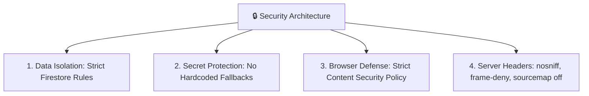

# 🔒 Security Architecture & Threat Model

Safety Guardian applies defense-in-depth principles to protect user geolocation, personal medical records, and emergency telephony credentials.

---

## 🛡️ Security Pillars

---

## 📋 Security Controls Matrix

| Threat Vector | Mitigation Implemented | File Reference |
| :--- | :--- | :--- |
| **Cross-User Data Leakage** | Firestore rule checks `request.auth.uid == userId` | `firestore.rules` |
| **API Key Harvesting** | Removed all hardcoded fallbacks; read strictly from environment | `src/services/*` |
| **Cross-Site Scripting (XSS)** | CSP meta tag restricting `script-src` and `connect-src` | `index.html` |
| **Source Code Reverse Engineering** | Production source maps disabled (`sourcemap: false`) | `vite.config.js` |
| **Location Privacy Leakage** | Stripped all precise GPS `console.log` statements | `src/services/location.js` |
| **Dependency Vulnerabilities** | Automated `npm audit` remediation (0 known CVEs) | `package-lock.json` |
