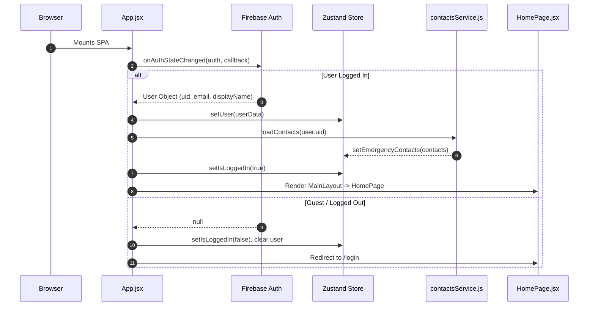

# 🔄 Workflow: Application Startup & Auth Hydration

```mermaid
sequenceDiagram
    autonumber
    participant Browser
    participant App as App.jsx
    participant Auth as Firebase Auth
    participant Store as Zustand Store
    participant Contacts as contactsService.js
    participant UI as HomePage.jsx

    Browser->>App: Mounts SPA
    App->>Auth: onAuthStateChanged(auth, callback)
    alt User Logged In
        Auth-->>App: User Object (uid, email, displayName)
        App->>Store: setUser(userData)
        App->>Contacts: loadContacts(user.uid)
        Contacts-->>Store: setEmergencyContacts(contacts)
        App->>Store: setIsLoggedIn(true)
        App->>UI: Render MainLayout -> HomePage
    else Guest / Logged Out
        Auth-->>App: null
        App->>Store: setIsLoggedIn(false), clear user
        App->>UI: Redirect to /login
    end
```
